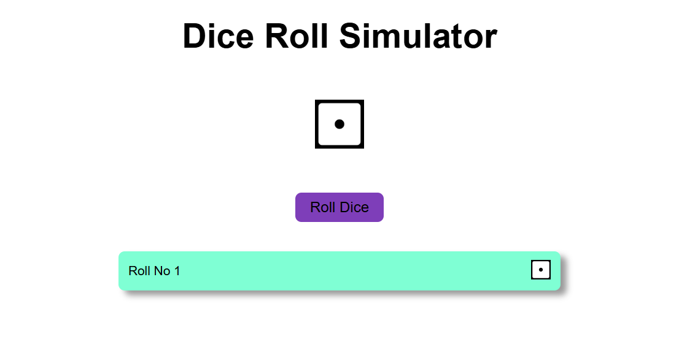

# 🎲 Dice Roll Simulator

An interactive Dice Roll Simulator built with **HTML, CSS, and JavaScript** that generates random dice rolls with smooth animations and maintains a history of all results.

## 🚀 Live Demo

Add your GitHub Pages link here:

https://your-live-demo-link

## 📸 Preview

Add a screenshot of the project here.



---

## ✨ Features

- Generate random dice rolls from 1 to 6
- Smooth rolling animation
- Roll history tracking
- Visual dice face updates
- Responsive design for mobile and desktop devices
- Clean and simple user interface

---

## 🛠️ Built With

- HTML5
- CSS3
- JavaScript (ES6)

---

## 🎯 How It Works

1. Click the **Roll Dice** button.
2. A random number between **1 and 6** is generated.
3. The dice performs a rolling animation.
4. The corresponding dice face is displayed.
5. The result is added to the roll history section.

---

## 📂 Project Structure

```text
Dice-Roll-Simulator
│
├── index.html
├── style.css
├── script.js
├── 1.png
├── 2.png
├── 3.png
├── 4.png
├── 5.png
└── 6.png
```

---

## 💡 What I Learned

While building this project, I practiced:

- DOM Manipulation
- Event Handling
- CSS Animations
- Responsive Web Design
- Dynamic Element Creation
- JavaScript Random Number Generation

---

## 🔮 Future Enhancements

- Multiple dice support
- Roll statistics and analytics
- Sound effects
- Dark mode
- Clear history option
- Custom animation styles

---

## 📱 Responsive Design

The application is designed to work smoothly across:

- Mobile Phones
- Tablets
- Laptops
- Desktop Screens

---

## ⚙️ Installation

Clone the repository:

```bash
git clone https://github.com/your-username/Dice-Roll-Simulator.git
```

Navigate to the project folder:

```bash
cd Dice-Roll-Simulator
```

Open `index.html` in your browser.

---

## 📸 Preview


## Live Demo


## 👨‍💻 Author

**Hemant Kohli**

Aspiring Web Developer currently learning and building projects using HTML, CSS, and JavaScript.

---

## ⭐ Support

If you found this project useful, consider giving it a star on GitHub.